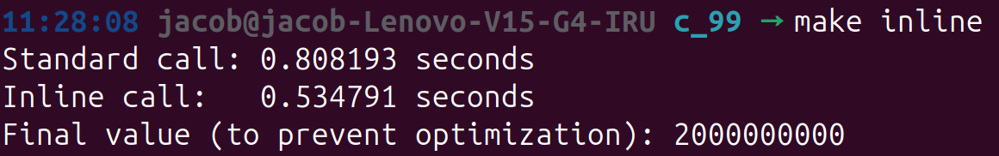

+++
title = "Standard features of C99"
date = "2026-04-21T23:05:00Z"
draft = false
tags = ["C99", "C"]
categories = ["Programming"]
featureimage = "featured.svg"
+++





Everyone thinks that they know C99 when developing in C but do they? (Well I probably don’t Xd)

Today I’ll be exploring some features of C99 to get familiar with the standard.

# Features

## inline

https://en.cppreference.com/c/language/inline

```c
inline const char *saddr(void) // the inline definition for use in this file
{
    static const char name[] = "saddr";
    return name;
}

int compare_name(void)
{
    return saddr() == saddr(); // unspecified behavior, one call could be external
}

extern const char *saddr(void); // an external definition is generated, too
```

- instead of calling the function and adding a call stack, inline keyword will hint the compiler to insert code where the function is called reducing function call overhead
- There is a disadvantage that the code size increases when a function is called from multiple places.
    - I think I heard that in embedded systems, `define` is used instead for this reason.
- If you do not make it static when calling from the same file, it cannot be found.
    - In C, functions default to extern, so there is no need to add extern when declaring them in another file.
    - static = local
- Ignores inline when using -O0
- To enforce inline in -O0, borrow the power of gcc
    - __attribute__((always_inline)) static inline void add_one_inline(int *x)
- it’s better not to mess with inline unless you really know what you’re doing as compiler usually adds inline whenever applicable

### disassembly (AT&T)

```nasm
0000000000001189 <add_one>:
    1189:	f3 0f 1e fa          	endbr64
    118d:	55                   	push   %rbp
    118e:	48 89 e5             	mov    %rsp,%rbp
    1191:	48 89 7d f8          	mov    %rdi,-0x8(%rbp)
    1195:	48 8b 45 f8          	mov    -0x8(%rbp),%rax
    1199:	8b 00                	mov    (%rax),%eax
    119b:	8d 50 01             	lea    0x1(%rax),%edx
    119e:	48 8b 45 f8          	mov    -0x8(%rbp),%rax
    11a2:	89 10                	mov    %edx,(%rax)
    11a4:	90                   	nop
    11a5:	5d                   	pop    %rbp
    11a6:	c3                   	ret

00000000000011a7 <get_time_in_seconds>:
    11a7:	f3 0f 1e fa          	endbr64
    11ab:	55                   	push   %rbp
    11ac:	48 89 e5             	mov    %rsp,%rbp
    11af:	48 83 ec 20          	sub    $0x20,%rsp
    11b3:	64 48 8b 04 25 28 00 	mov    %fs:0x28,%rax
    11ba:	00 00 
    11bc:	48 89 45 f8          	mov    %rax,-0x8(%rbp)
    11c0:	31 c0                	xor    %eax,%eax
    11c2:	48 8d 45 e0          	lea    -0x20(%rbp),%rax
    11c6:	48 89 c6             	mov    %rax,%rsi
    11c9:	bf 01 00 00 00       	mov    $0x1,%edi
    11ce:	e8 9d fe ff ff       	call   1070 <clock_gettime@plt>
    11d3:	48 8b 45 e0          	mov    -0x20(%rbp),%rax
    11d7:	66 0f ef c9          	pxor   %xmm1,%xmm1
    11db:	f2 48 0f 2a c8       	cvtsi2sd %rax,%xmm1
    11e0:	48 8b 45 e8          	mov    -0x18(%rbp),%rax
    11e4:	66 0f ef c0          	pxor   %xmm0,%xmm0
    11e8:	f2 48 0f 2a c0       	cvtsi2sd %rax,%xmm0
    11ed:	f2 0f 10 15 a3 0e 00 	movsd  0xea3(%rip),%xmm2        # 2098 <_IO_stdin_used+0x98>
    11f4:	00 
    11f5:	f2 0f 5e c2          	divsd  %xmm2,%xmm0
    11f9:	f2 0f 58 c1          	addsd  %xmm1,%xmm0
    11fd:	48 8b 45 f8          	mov    -0x8(%rbp),%rax
    1201:	64 48 2b 04 25 28 00 	sub    %fs:0x28,%rax
    1208:	00 00 
    120a:	74 05                	je     1211 <get_time_in_seconds+0x6a>
    120c:	e8 6f fe ff ff       	call   1080 <__stack_chk_fail@plt>
    1211:	c9                   	leave
    1212:	c3                   	ret

0000000000001213 <main>:
    1213:	f3 0f 1e fa          	endbr64
    1217:	55                   	push   %rbp
    1218:	48 89 e5             	mov    %rsp,%rbp
    121b:	48 83 ec 30          	sub    $0x30,%rsp
    121f:	64 48 8b 04 25 28 00 	mov    %fs:0x28,%rax
    1226:	00 00 
    1228:	48 89 45 f8          	mov    %rax,-0x8(%rbp)
    122c:	31 c0                	xor    %eax,%eax
    122e:	c7 45 d0 00 00 00 00 	movl   $0x0,-0x30(%rbp)
    1235:	c7 45 d4 00 00 00 00 	movl   $0x0,-0x2c(%rbp)
    123c:	be 80 96 98 00       	mov    $0x989680,%esi
    1241:	48 8d 05 c0 0d 00 00 	lea    0xdc0(%rip),%rax        # 2008 <_IO_stdin_used+0x8>
    1248:	48 89 c7             	mov    %rax,%rdi
    124b:	b8 00 00 00 00       	mov    $0x0,%eax
    1250:	e8 3b fe ff ff       	call   1090 <printf@plt>
    1255:	b8 00 00 00 00       	mov    $0x0,%eax
    125a:	e8 48 ff ff ff       	call   11a7 <get_time_in_seconds>
    125f:	66 48 0f 7e c0       	movq   %xmm0,%rax
    1264:	48 89 45 e0          	mov    %rax,-0x20(%rbp)
    1268:	c7 45 d8 00 00 00 00 	movl   $0x0,-0x28(%rbp)
    126f:	eb 10                	jmp    1281 <main+0x6e>
    1271:	48 8d 45 d0          	lea    -0x30(%rbp),%rax
    1275:	48 89 c7             	mov    %rax,%rdi
    1278:	e8 0c ff ff ff       	call   1189 <add_one>
    127d:	83 45 d8 01          	addl   $0x1,-0x28(%rbp)
    1281:	81 7d d8 7f 96 98 00 	cmpl   $0x98967f,-0x28(%rbp)
    1288:	7e e7                	jle    1271 <main+0x5e>
    128a:	b8 00 00 00 00       	mov    $0x0,%eax
    128f:	e8 13 ff ff ff       	call   11a7 <get_time_in_seconds>
    1294:	66 48 0f 7e c0       	movq   %xmm0,%rax
    1299:	48 89 45 e8          	mov    %rax,-0x18(%rbp)
    129d:	f2 0f 10 45 e8       	movsd  -0x18(%rbp),%xmm0
    12a2:	f2 0f 5c 45 e0       	subsd  -0x20(%rbp),%xmm0
    12a7:	66 48 0f 7e c0       	movq   %xmm0,%rax
    12ac:	66 48 0f 6e c0       	movq   %rax,%xmm0
    12b1:	48 8d 05 7a 0d 00 00 	lea    0xd7a(%rip),%rax        # 2032 <_IO_stdin_used+0x32>
    12b8:	48 89 c7             	mov    %rax,%rdi
    12bb:	b8 01 00 00 00       	mov    $0x1,%eax
    12c0:	e8 cb fd ff ff       	call   1090 <printf@plt>
    12c5:	b8 00 00 00 00       	mov    $0x0,%eax
    12ca:	e8 d8 fe ff ff       	call   11a7 <get_time_in_seconds>
    12cf:	66 48 0f 7e c0       	movq   %xmm0,%rax
    12d4:	48 89 45 e0          	mov    %rax,-0x20(%rbp)
    12d8:	c7 45 dc 00 00 00 00 	movl   $0x0,-0x24(%rbp)
    12df:	eb 1c                	jmp    12fd <main+0xea>
    12e1:	48 8d 45 d4          	lea    -0x2c(%rbp),%rax
    12e5:	48 89 45 f0          	mov    %rax,-0x10(%rbp)
    12e9:	48 8b 45 f0          	mov    -0x10(%rbp),%rax
    12ed:	8b 00                	mov    (%rax),%eax
    12ef:	8d 50 01             	lea    0x1(%rax),%edx
    12f2:	48 8b 45 f0          	mov    -0x10(%rbp),%rax
    12f6:	89 10                	mov    %edx,(%rax)
    12f8:	90                   	nop
    12f9:	83 45 dc 01          	addl   $0x1,-0x24(%rbp)
    12fd:	81 7d dc 7f 96 98 00 	cmpl   $0x98967f,-0x24(%rbp)
    1304:	7e db                	jle    12e1 <main+0xce>
    1306:	b8 00 00 00 00       	mov    $0x0,%eax
    130b:	e8 97 fe ff ff       	call   11a7 <get_time_in_seconds>
    1310:	66 48 0f 7e c0       	movq   %xmm0,%rax
    1315:	48 89 45 e8          	mov    %rax,-0x18(%rbp)
    1319:	f2 0f 10 45 e8       	movsd  -0x18(%rbp),%xmm0
    131e:	f2 0f 5c 45 e0       	subsd  -0x20(%rbp),%xmm0
    1323:	66 48 0f 7e c0       	movq   %xmm0,%rax
    1328:	66 48 0f 6e c0       	movq   %rax,%xmm0
    132d:	48 8d 05 19 0d 00 00 	lea    0xd19(%rip),%rax        # 204d <_IO_stdin_used+0x4d>
    1334:	48 89 c7             	mov    %rax,%rdi
    1337:	b8 01 00 00 00       	mov    $0x1,%eax
    133c:	e8 4f fd ff ff       	call   1090 <printf@plt>
    1341:	8b 55 d0             	mov    -0x30(%rbp),%edx
    1344:	8b 45 d4             	mov    -0x2c(%rbp),%eax
    1347:	01 d0                	add    %edx,%eax
    1349:	89 05 c5 2c 00 00    	mov    %eax,0x2cc5(%rip)        # 4014 <global_sink>
    134f:	8b 05 bf 2c 00 00    	mov    0x2cbf(%rip),%eax        # 4014 <global_sink>
    1355:	89 c6                	mov    %eax,%esi
    1357:	48 8d 05 0a 0d 00 00 	lea    0xd0a(%rip),%rax        # 2068 <_IO_stdin_used+0x68>
    135e:	48 89 c7             	mov    %rax,%rdi
    1361:	b8 00 00 00 00       	mov    $0x0,%eax
    1366:	e8 25 fd ff ff       	call   1090 <printf@plt>
    136b:	b8 00 00 00 00       	mov    $0x0,%eax
    1370:	48 8b 55 f8          	mov    -0x8(%rbp),%rdx
    1374:	64 48 2b 14 25 28 00 	sub    %fs:0x28,%rdx
    137b:	00 00 
    137d:	74 05                	je     1384 <main+0x171>
    137f:	e8 fc fc ff ff       	call   1080 <__stack_chk_fail@plt>
    1384:	c9                   	leave
    1385:	c3                   	ret
```

### disassembly (Intel)

```nasm
0000000000001189 <add_one>:
    1189:	f3 0f 1e fa          	endbr64
    118d:	55                   	push   rbp
    118e:	48 89 e5             	mov    rbp,rsp
    1191:	48 89 7d f8          	mov    QWORD PTR [rbp-0x8],rdi
    1195:	48 8b 45 f8          	mov    rax,QWORD PTR [rbp-0x8]
    1199:	8b 00                	mov    eax,DWORD PTR [rax]
    119b:	8d 50 01             	lea    edx,[rax+0x1]
    119e:	48 8b 45 f8          	mov    rax,QWORD PTR [rbp-0x8]
    11a2:	89 10                	mov    DWORD PTR [rax],edx
    11a4:	90                   	nop
    11a5:	5d                   	pop    rbp
    11a6:	c3                   	ret

00000000000011a7 <get_time_in_seconds>:
    11a7:	f3 0f 1e fa          	endbr64
    11ab:	55                   	push   rbp
    11ac:	48 89 e5             	mov    rbp,rsp
    11af:	48 83 ec 20          	sub    rsp,0x20
    11b3:	64 48 8b 04 25 28 00 	mov    rax,QWORD PTR fs:0x28
    11ba:	00 00 
    11bc:	48 89 45 f8          	mov    QWORD PTR [rbp-0x8],rax
    11c0:	31 c0                	xor    eax,eax
    11c2:	48 8d 45 e0          	lea    rax,[rbp-0x20]
    11c6:	48 89 c6             	mov    rsi,rax
    11c9:	bf 01 00 00 00       	mov    edi,0x1
    11ce:	e8 9d fe ff ff       	call   1070 <clock_gettime@plt>
    11d3:	48 8b 45 e0          	mov    rax,QWORD PTR [rbp-0x20]
    11d7:	66 0f ef c9          	pxor   xmm1,xmm1
    11db:	f2 48 0f 2a c8       	cvtsi2sd xmm1,rax
    11e0:	48 8b 45 e8          	mov    rax,QWORD PTR [rbp-0x18]
    11e4:	66 0f ef c0          	pxor   xmm0,xmm0
    11e8:	f2 48 0f 2a c0       	cvtsi2sd xmm0,rax
    11ed:	f2 0f 10 15 a3 0e 00 	movsd  xmm2,QWORD PTR [rip+0xea3]        # 2098 <_IO_stdin_used+0x98>
    11f4:	00 
    11f5:	f2 0f 5e c2          	divsd  xmm0,xmm2
    11f9:	f2 0f 58 c1          	addsd  xmm0,xmm1
    11fd:	48 8b 45 f8          	mov    rax,QWORD PTR [rbp-0x8]
    1201:	64 48 2b 04 25 28 00 	sub    rax,QWORD PTR fs:0x28
    1208:	00 00 
    120a:	74 05                	je     1211 <get_time_in_seconds+0x6a>
    120c:	e8 6f fe ff ff       	call   1080 <__stack_chk_fail@plt>
    1211:	c9                   	leave
    1212:	c3                   	ret

0000000000001213 <main>:
    1213:	f3 0f 1e fa          	endbr64
    1217:	55                   	push   rbp
    1218:	48 89 e5             	mov    rbp,rsp
    121b:	48 83 ec 30          	sub    rsp,0x30
    121f:	64 48 8b 04 25 28 00 	mov    rax,QWORD PTR fs:0x28
    1226:	00 00 
    1228:	48 89 45 f8          	mov    QWORD PTR [rbp-0x8],rax
    122c:	31 c0                	xor    eax,eax
    122e:	c7 45 d0 00 00 00 00 	mov    DWORD PTR [rbp-0x30],0x0
    1235:	c7 45 d4 00 00 00 00 	mov    DWORD PTR [rbp-0x2c],0x0
    123c:	be 80 96 98 00       	mov    esi,0x989680
    1241:	48 8d 05 c0 0d 00 00 	lea    rax,[rip+0xdc0]        # 2008 <_IO_stdin_used+0x8>
    1248:	48 89 c7             	mov    rdi,rax
    124b:	b8 00 00 00 00       	mov    eax,0x0
    1250:	e8 3b fe ff ff       	call   1090 <printf@plt>
    1255:	b8 00 00 00 00       	mov    eax,0x0
    125a:	e8 48 ff ff ff       	call   11a7 <get_time_in_seconds>
    125f:	66 48 0f 7e c0       	movq   rax,xmm0
    1264:	48 89 45 e0          	mov    QWORD PTR [rbp-0x20],rax
    1268:	c7 45 d8 00 00 00 00 	mov    DWORD PTR [rbp-0x28],0x0
    126f:	eb 10                	jmp    1281 <main+0x6e>
    1271:	48 8d 45 d0          	lea    rax,[rbp-0x30]
    1275:	48 89 c7             	mov    rdi,rax
    1278:	e8 0c ff ff ff       	call   1189 <add_one>
    127d:	83 45 d8 01          	add    DWORD PTR [rbp-0x28],0x1
    1281:	81 7d d8 7f 96 98 00 	cmp    DWORD PTR [rbp-0x28],0x98967f
    1288:	7e e7                	jle    1271 <main+0x5e>
    128a:	b8 00 00 00 00       	mov    eax,0x0
    128f:	e8 13 ff ff ff       	call   11a7 <get_time_in_seconds>
    1294:	66 48 0f 7e c0       	movq   rax,xmm0
    1299:	48 89 45 e8          	mov    QWORD PTR [rbp-0x18],rax
    129d:	f2 0f 10 45 e8       	movsd  xmm0,QWORD PTR [rbp-0x18]
    12a2:	f2 0f 5c 45 e0       	subsd  xmm0,QWORD PTR [rbp-0x20]
    12a7:	66 48 0f 7e c0       	movq   rax,xmm0
    12ac:	66 48 0f 6e c0       	movq   xmm0,rax
    12b1:	48 8d 05 7a 0d 00 00 	lea    rax,[rip+0xd7a]        # 2032 <_IO_stdin_used+0x32>
    12b8:	48 89 c7             	mov    rdi,rax
    12bb:	b8 01 00 00 00       	mov    eax,0x1
    12c0:	e8 cb fd ff ff       	call   1090 <printf@plt>
    12c5:	b8 00 00 00 00       	mov    eax,0x0
    12ca:	e8 d8 fe ff ff       	call   11a7 <get_time_in_seconds>
    12cf:	66 48 0f 7e c0       	movq   rax,xmm0
    12d4:	48 89 45 e0          	mov    QWORD PTR [rbp-0x20],rax
    12d8:	c7 45 dc 00 00 00 00 	mov    DWORD PTR [rbp-0x24],0x0
    12df:	eb 1c                	jmp    12fd <main+0xea>
    12e1:	48 8d 45 d4          	lea    rax,[rbp-0x2c]
    12e5:	48 89 45 f0          	mov    QWORD PTR [rbp-0x10],rax
    12e9:	48 8b 45 f0          	mov    rax,QWORD PTR [rbp-0x10]
    12ed:	8b 00                	mov    eax,DWORD PTR [rax]
    12ef:	8d 50 01             	lea    edx,[rax+0x1]
    12f2:	48 8b 45 f0          	mov    rax,QWORD PTR [rbp-0x10]
    12f6:	89 10                	mov    DWORD PTR [rax],edx
    12f8:	90                   	nop
    12f9:	83 45 dc 01          	add    DWORD PTR [rbp-0x24],0x1
    12fd:	81 7d dc 7f 96 98 00 	cmp    DWORD PTR [rbp-0x24],0x98967f
    1304:	7e db                	jle    12e1 <main+0xce>
    1306:	b8 00 00 00 00       	mov    eax,0x0
    130b:	e8 97 fe ff ff       	call   11a7 <get_time_in_seconds>
    1310:	66 48 0f 7e c0       	movq   rax,xmm0
    1315:	48 89 45 e8          	mov    QWORD PTR [rbp-0x18],rax
    1319:	f2 0f 10 45 e8       	movsd  xmm0,QWORD PTR [rbp-0x18]
    131e:	f2 0f 5c 45 e0       	subsd  xmm0,QWORD PTR [rbp-0x20]
    1323:	66 48 0f 7e c0       	movq   rax,xmm0
    1328:	66 48 0f 6e c0       	movq   xmm0,rax
    132d:	48 8d 05 19 0d 00 00 	lea    rax,[rip+0xd19]        # 204d <_IO_stdin_used+0x4d>
    1334:	48 89 c7             	mov    rdi,rax
    1337:	b8 01 00 00 00       	mov    eax,0x1
    133c:	e8 4f fd ff ff       	call   1090 <printf@plt>
    1341:	8b 55 d0             	mov    edx,DWORD PTR [rbp-0x30]
    1344:	8b 45 d4             	mov    eax,DWORD PTR [rbp-0x2c]
    1347:	01 d0                	add    eax,edx
    1349:	89 05 c5 2c 00 00    	mov    DWORD PTR [rip+0x2cc5],eax        # 4014 <global_sink>
    134f:	8b 05 bf 2c 00 00    	mov    eax,DWORD PTR [rip+0x2cbf]        # 4014 <global_sink>
    1355:	89 c6                	mov    esi,eax
    1357:	48 8d 05 0a 0d 00 00 	lea    rax,[rip+0xd0a]        # 2068 <_IO_stdin_used+0x68>
    135e:	48 89 c7             	mov    rdi,rax
    1361:	b8 00 00 00 00       	mov    eax,0x0
    1366:	e8 25 fd ff ff       	call   1090 <printf@plt>
    136b:	b8 00 00 00 00       	mov    eax,0x0
    1370:	48 8b 55 f8          	mov    rdx,QWORD PTR [rbp-0x8]
    1374:	64 48 2b 14 25 28 00 	sub    rdx,QWORD PTR fs:0x28
    137b:	00 00 
    137d:	74 05                	je     1384 <main+0x171>
    137f:	e8 fc fc ff ff       	call   1080 <__stack_chk_fail@plt>
    1384:	c9                   	leave
    1385:	c3                   	ret
```

- Disassembly shows no symbol for add_one_inline



### Decl intermingled with code

```c
...
printf("Hello World!");
int a = 10; //decl intermingled with code

for (int i = 0; i < a; i++) //int i inter mingled with for loop
	...
```

- I did not know that this was possible only after C99 😲

## _Bool / stdbool.h

```c
#include <stdio.h>
#include <stdbool.h>

int main() {
	_Bool is_today_a_good_day = 1;

	if (is_today_a_good_day)
		printf("Today is a good day :)\n");

	bool is_today_also_a_good_day = true;

	if (is_today_also_a_good_day)
		printf("Today is also a good day :)\n");
}
```

- pretty straight forward

### stdbool.h

```c
#ifndef __STDBOOL_H
#define __STDBOOL_H

#define __bool_true_false_are_defined 1

#if defined(__STDC_VERSION__) && __STDC_VERSION__ > 201710L
/* FIXME: We should be issuing a deprecation warning here, but cannot yet due
 * to system headers which include this header file unconditionally.
 */
#elif !defined(__cplusplus)
#define bool _Bool
#define true 1
#define false 0
#elif defined(__GNUC__) && !defined(__STRICT_ANSI__)
/* Define _Bool as a GNU extension. */
#define _Bool bool
#if defined(__cplusplus) && __cplusplus < 201103L
/* For C++98, define bool, false, true as a GNU extension. */
#define bool bool
#define false false
#define true true
#endif
#endif

#endif /* __STDBOOL_H */

```

## Complex type

```c
#include <stdio.h>
#include <complex.h>

int main() {
    // 1. Declaration and Initialization
    // 'I' is a macro defined in complex.h representing the imaginary unit
    double complex z1 = 3.0 + 4.0 * I;
    double complex z2 = 1.0 - 2.0 * I;

    // 2. Native Arithmetic
    // You can use standard operators (+, -, *, /) directly on complex types
    double complex sum = z1 + z2;
    double complex diff = z1 - z2;
    double complex product = z1 * z2;

    // 3. Printing Complex Numbers
    // printf doesn't have a direct format specifier for complex numbers,
    // so you extract the real and imaginary parts using creal() and cimag()
    printf("z1      = %.1f %+.1fi\n", creal(z1), cimag(z1));
    printf("z2      = %.1f %+.1fi\n", creal(z2), cimag(z2));
    
    printf("\n--- Results ---\n");
    printf("Sum     = %.1f %+.1fi\n", creal(sum), cimag(sum));
    printf("Diff    = %.1f %+.1fi\n", creal(diff), cimag(diff));
    printf("Product = %.1f %+.1fi\n", creal(product), cimag(product));

    return 0;
}
```


## Flexible array members

```c
#include <stdio.h>
#include <stdlib.h>

// --- Approach 1: Struct with a Pointer ---
struct PointerVector {
    size_t length;
    int *data;
};

// --- Approach 2: Struct with a Flexible Array ---
struct FlexibleVector {
    size_t length;
    int data[]; // Flexible array must be the last member
};

int main() {
    size_t num_items = 5;

    printf("=== Approach 1: Pointer Member (2 Mallocs) ===\n");
    
    // Allocation
    struct PointerVector *p_vec = malloc(sizeof(struct PointerVector));
    if (!p_vec) return 1;
    p_vec->length = num_items;
    p_vec->data = malloc(num_items * sizeof(int));
    if (!p_vec->data) { free(p_vec); return 1; }

    // Print sizes and memory layout
    printf("Reported struct size: %zu bytes\n", sizeof(struct PointerVector));
    printf("Struct is located at: %p\n", (void*)p_vec);
    printf("Data is located at:   %p  <-- Notice the massive jump in memory!\n", (void*)p_vec->data);

    // Cleanup (Order matters!)
    free(p_vec->data);
    free(p_vec);

    printf("\n--------------------------------------------------\n\n");

    printf("=== Approach 2: Flexible Array (1 Malloc) ===\n");

    // Allocation
    size_t total_size = sizeof(struct FlexibleVector) + (num_items * sizeof(int));
    struct FlexibleVector *f_vec = malloc(total_size);
    if (!f_vec) return 1;
    f_vec->length = num_items;

    // Print sizes and memory layout
    printf("Reported struct size: %zu bytes (Notice it's smaller!)\n", sizeof(struct FlexibleVector));
    printf("Struct is located at: %p\n", (void*)f_vec);
    printf("Data is located at:   %p  <-- Notice it is immediately after the struct!\n", (void*)f_vec->data);

    // Cleanup (Just one call)
    free(f_vec);

    return 0;
}
```

### The 3 Golden Rules of Flexible Array Members

If you use these, the compiler expects you to follow three strict rules:

1. **It must be last:** You can only put `[]` on the very last variable in the `struct`.
2. **It cannot be alone:** The `struct` must contain at least one other standard (named) member before the flexible array. You can't just have a struct containing only `int data[]`.
3. **`sizeof()` ignores it:** If you run `sizeof(struct DynamicVector)`, it will return the size of the `length` variable (plus any padding). It calculates the size as if the flexible array does not exist at all. That is exactly why you have to manually add the array size during the `malloc` call.

### Linux Kernel Example

```c
struct inotify_event {
    __s32           wd;             /* watch descriptor */
    __u32           mask;           /* watch mask */
    __u32           cookie;         /* cookie to synchronize two events */
    __u32           len;            /* length (including nulls) of name */
    char            name[];         /* stub for possible name */
};
```

- The Linux Kernel uses this technique quiet often. (At least the ones i’ve seen Xd)
- If name was a char *
    - alloc `struct inotify_event`
    - alloc `char *name`
    - assign `name` to `struct inotify_event`
- Flexible Arrray Member allows
    - alloc(sizeof(inotify_even) + /* size of name */)
    - allocation in one go. No need to pass around pointers either

It’s a neat trick!

## tgmath.h

```c
float res1 = sqrt(f);  // The compiler silently translates this to sqrtf(f)
    double res2 = sqrt(d); // Translates to standard sqrt(d)
    long double res3 = sqrt(ld); // Translates to sqrtl(ld)
    
    double complex res4 = sqrt(z); // Translates to csqrt(z)

    printf("Float root:  %.1f\n", res1);
    printf("Double root: %.1f\n", res2);
    printf("Long root:   %.1Lf\n", res3);
    printf("Complex root: %.1f %+.1fi\n", creal(res4), cimag(res4));
```

- compiler silently translate sqrt to sqrtf, sqrtl, csqrt
- don’t know if anyone uses this

[The ugliest C feature: <tgmath.h>](https://www.reddit.com/r/programming/comments/1maa65/the_ugliest_c_feature_tgmathh/)

- gg

## Designated Initializers

```c
#include <stdio.h>

struct point {
    int x;
    int y;
    int z;
};

int main() {
    // Designated initializers for structures
    struct point p = { .y = 2, .x = 1, .z = 3 };

    // Designated initializers for arrays
    int arr[10] = { [2] = 20, [5] = 50, [8] = 80 };

    printf("Point: x=%d, y=%d, z=%d\n", p.x, p.y, p.z);
    
    printf("Array elements:\n");
    for (int i = 0; i < 10; i++) {
        if (arr[i] != 0) {
            printf("arr[%d] = %d\n", i, arr[i]);
        }
    }

    return 0;
}
```

## Compound Literal

```c
#include <stdio.h>

struct Point {
    int x;
    int y;
};

// A simple function that expects a struct
void draw_point(struct Point p) {
    printf("Drawing at X:%d, Y:%d\n", p.x, p.y);
}

// A function that expects a POINTER to a struct
void move_point(struct Point *p, int dx, int dy) {
    p->x += dx;
    p->y += dy;
    printf("Moved to X:%d, Y:%d\n", p->x, p->y);
}

int main() {
    // --- The Old Way (C89) ---
    // We have to pollute our scope with a variable we only use once
    struct Point temp_p = {10, 20};
    draw_point(temp_p);

    // --- The New Way (Compound Literal) ---
    // We create an unnamed struct directly inside the function call!
    draw_point((struct Point){30, 40});

    // --- The "Ultimate" Way ---
    // Combining compound literals WITH designated initializers
    draw_point((struct Point){ .y = 100, .x = 50 });

    // --- The Magic Trick (Taking the address) ---
    // Unlike standard literals (like the number 5), compound literals actually 
    // exist in memory. That means you can take their address using '&'!
    move_point(&(struct Point){1, 1}, 5, 5);

    // --- Array on the fly ---
    // We can pass an entire array without declaring a variable for it!
    print_sum((int[]){10, 20, 30, 40, 50}, 5);

    return 0;
}
ress using '&'!
    move_point(&(struct Point){1, 1}, 5, 5);

    return 0;
}

```

### 3 Golden Rules of Compound Literals

1. **They are L-values:** Unlike a cast (e.g., `(int)3.14`), a compound literal actually creates a real object in RAM. This means you can get its memory address using `&`, modify its contents, or pass it as a pointer.
2. **Scope applies:** The temporary object is created in the scope of the block it was defined in. It will be destroyed when the block ends. **Never** return a pointer to a compound literal from a function!
    
    ```c
    // DANGEROUS! The array dies when the function returns.
    int* bad_function() {
        return (int[]){1, 2, 3}; 
    }
    ```
    
3. **Read-only is optional:** If you add the `const`keyword, the compiler might optimize it by placing it in read-only memory, just like a string literal.
    
    ```c
    draw_point((const struct Point){10, 20});
    ```
    

## Variadic Macros

```c
#include <stdio.h>

// The '...' means this macro accepts extra arguments.
// __VA_ARGS__ is replaced by whatever those extra arguments are.
#define LOG_INFO(format, ...) printf("[INFO] " format "\n", __VA_ARGS__)

int main() {
    int users = 5;
    char *system = "Database";

    // Expands to: printf("[INFO] " "System %s has %d users." "\n", system, users)
    LOG_INFO("System %s has %d users.", system, users);

    return 0;
}
```

- This is used often in the kernel

## restrict keyword

This is one of the first keyword I’ve faced during my journey in 42seoul.

```c
#include <string.h>

void *memcpy(size_t n;
						 void dest[restrict n],
						 const void src[restrict n], size_t n);
```

- Since there’s pointer aliasing in C dest and src could be pointing to the overlapping memory location causing garbage value to be copied.

```c
void add_stuff(int *a, int *b, int *out) {
    *out = *a + 10;
    *out = *a + *b; 
}
```

- It cannot keep memory at register if memory overlaps
    - have to re-read data on the second line
- `restrict` keyword promises that this memory will not be accessed by any other pointer for the life time of this pointer.
    - Allows aggressive performance optimization - no need to re-read.
    - It can loads giant chunks of memory to the cache
        - Allows SIMD
- It is the programmer’s job to keep restrict qualification or else UB.

## Static in brackets

I’ve never seen this one for myself.

### The problem - Array decay

```c
void process_data(int data[100]) {
    // ...
}
```

- In standard C, array size declared for the parameter of the function signature does not matter and simply decays into a `int *`

```c
void process_data_fast(int data[static 100]) {
    // ...
}
```

- tells the compiler that data passed is never `null` and at least `100` in size

```c
// 'data' is a const pointer (you can't make it point anywhere else), 
// and it is restricted (no aliasing), 
// AND it guarantees at least 10 elements!
void ultra_fast_math(int data[const restrict static 10]);
```

- apparently this is ultra fast…?

### Disassemble

```nasm
				lea     rax, [rcx-4]
        mov     r8, rax
        sub     r8, rsi       <-- Subtracting pointer addresses!
        cmp     r8, 8         <-- Checking if they overlap by 8 bytes or less!
        jbe     .L12          <-- If they overlap, ABORT and jump to .L12
        sub     rax, rdx
        cmp     rax, 8
        jbe     .L12          <-- If they overlap, ABORT and jump to .L12
```

- fast path - doesn’t overlap
- runtime overhead of checking overlap

```nasm
.L12:
        xor     eax, eax
.L9:
        mov     r8d, DWORD PTR [rdx+rax*4]
        add     r8d, DWORD PTR [rsi+rax*4]    <-- Slow, 1-by-1 scalar addition
        mov     DWORD PTR [rcx+rax*4], r8d
        add     rax, 1
        cmp     rdi, rax
        jne     .L9
```

- slow path - overlaps

[Compiler Explorer - C (x86-64 gcc 15.2)](https://godbolt.org/z/WTjoE3E4T)

- actual performance difference seems to be minimal?
- maybe things might much faster in other cases.

## Others

- long long int - 64bit integer
- Variable Length Arrays (VLA)
    - relegated
- support one-line comments
- snprintf
- `<stdbool.h>` , `<complex.h>`, `<tgmath.h>`, and `<inttypes.h>`
- IEEE 754-1985
    - Basically support for floating point
- Universal character names
    - allow user variables to contain other characters than ascii

---


