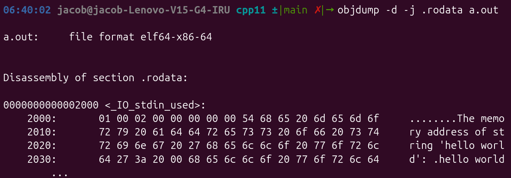

While using C standards 98 and 11, I had some knowledge about C standards. However, since I don't use C++ frequently, I usually only use the syntax I use for coding tests.

In this series, I'm going to take a look at modern C++, although it might be a bit much to call C++11 "modern"...

I will focus on [cppreference.com](http://cppreference.com) for the content.

# C++11

## `auto` and `decltype` / `decltype(auto)` (c++14)

### auto

```cpp
#include <iostream>

int main() {
    int x = 10;
    const int& cx = x; // cx is a constant reference to x

    // Type deduction with auto:
    auto a = cx;       // 'a' is deduced as 'int' (const and & are stripped). It's a copy.
    a = 20;            // Allowed! 'a' is a separate variable. 'x' is still 10.

    // If you WANT a reference or const, you have to ask for it explicitly:
    auto& b = cx;       // 'b' is deduced as 'const int&'
    const auto& c = x;  // 'c' is deduced as 'const int&'

    return 0;
}
```

- You can use `auto` instead of a type.
    - I think it's better to use it when the type can be inferred at a glance.
    - Since `auto a = cx` is not explicit, I think it's better not to use it in such cases.
- It is compile-time deduction.
- You should be careful because it strips `const` and `&` references.

```cpp
#include <iostream>
#include <vector>

std::vector<int> numbers = {10, 20, 30};

// Returns a reference to the element
int& getElement(int index) {
    return numbers[index];
}

// Wrapper function using auto (BUGGY if we want to modify the array)
auto badWrapper(int index) {
    return getElement(index); // 'auto' strips the &, so this returns a COPY of the int
}

// Wrapper function using decltype(auto) (PERFECT)
decltype(auto) goodWrapper(int index) {
    return getElement(index); // Deduces 'int&', perfectly forwarding the reference
}

int main() {
    goodWrapper(1) = 99; // Modifies numbers[1] to 99
    // badWrapper(1) = 99; // ERROR: Can't assign to a temporary copy
    return 0;
}
```

- `decltype` stands for "declared type". It returns the type without evaluating the expression.
- Unlike `auto`, `decltype` does not strip `const` or `&`, making it suitable for the code above.

### decltype

```cpp
#include <iostream>

int main() {
    int x = 10;
    const int& cx = x;

    // Type deduction with decltype:
    decltype(cx) d = x; // 'd' is deduced EXACTLY as 'const int&'
    
    // d = 20; // ERROR! d is const, you cannot modify it.

    // Another example: inspecting an expression
    int y = 5;
    decltype(x + y) z = 15; // 'z' is deduced as 'int' because (x + y) results in an int
    
    return 0;
}
```

```cpp
The placeholder auto may be accompanied by modifiers, such as const or &, which will participate in the type deduction. The placeholder decltype(auto) must be the sole constituent of the declared type.(since C++14)
```

```cpp
int x = 42;
int* ptr = &x;

const auto&  ref = x;   // Deduces auto = int, result is const int&
auto*        p   = ptr; // Deduces auto = int, result is int*
const auto*  cp  = ptr; // Deduces auto = int, result is const int*
auto&&       forwarding_ref = x; // Deduces auto = int& (via reference collapsing)
```

- As shown above, `auto` can be used with `const` or `&`.

```cpp
int x = 10;
const int& get_ref() { return x; }

// --- VALID USAGE ---
decltype(auto) a = get_ref(); // 'a' is EXACTLY const int&

// --- INVALID USAGE (Compiler Errors) ---
// const decltype(auto) b = get_ref(); 
// decltype(auto)& c = get_ref();

int main() {
    int x = 5;

    decltype(auto) y = x;   // y is 'int'
    decltype(auto) z = (x); // z is 'int&' (a reference to x!)

    z = 10; // This changes x to 10
}
```

- Unlike `auto`, `decltype(auto)` cannot be used with `const` or `&`.

## `defaulted` and `deleted` functions

### defaulted

```cpp
class NetworkPacket {
public:
    int payloadSize;

    // Custom constructor
    NetworkPacket(int size) : payloadSize(size) {} 

    // Because we wrote the one above, we lost the default constructor.
    // NetworkPacket() {} // We COULD write this, but there's a better way:
    
    NetworkPacket() = default; 
};
```

- In C++, if a class constructor is explicitly declared, the default constructor is not generated.
- If a default constructor is needed, you can explicitly overload the constructor, but C++11 allows you to explicitly use the default function by adding the `default` keyword.

### delete

```cpp
#include <iostream>

class TcpSocket {
private:
    int socket_fd;

public:
    TcpSocket() {
        // Assume this opens a real socket
        socket_fd = 10; 
    }

    ~TcpSocket() {
        // Close the socket
    }

    // --- C++11 Resource Protection ---
    // Ban copying! You cannot clone a hardware socket.
    TcpSocket(const TcpSocket& other) = delete;            // Copy constructor deleted
    TcpSocket& operator=(const TcpSocket& other) = delete; // Copy assignment deleted

    // (In a real system, you would provide move constructors here instead)
};

int main() {
    TcpSocket server;
    
    // TcpSocket client = server; // COMPILE ERROR: Call to deleted constructor!
    
    return 0;
}
```

- You can explicitly delete a function definition using the `delete` keyword.

```cpp
= delete ("error error error");
```

- As shown above, you can pass a string-literal to provide an error message (C++26).

## `final` and `override`

### final

Prevents inheritance or overriding.

### final (class)

```cpp
class Base final {
    // ...
};

// ERROR: Cannot inherit from a 'final' class.
class Derived : public Base { 
};
```

### final (virtual function)

```cpp
class Base {
public:
    virtual void process() { /* ... */ }
};

class Derived : public Base {
public:
    // Overrides Base::process, but prevents further overriding
    void process() override final { /* ... */ } 
};

class DeepDerived : public Derived {
public:
    // ERROR: 'process' was marked final in 'Derived'.
    // void process() override { /* ... */ } 
};
```

### override

```cpp
class Base {
public:
    virtual void doSomething(int x) const { /* ... */ }
};

class Derived : public Base {
public:
    // ERROR: Missing 'const'. The compiler catches this because of 'override'.
    // void doSomething(int x) override { /* ... */ } 

    // ERROR: Wrong parameter type (float instead of int).
    // void doSomething(float x) override { /* ... */ }

    // CORRECT: Matches the base class signature exactly.
    void doSomething(int x) const override { /* ... */ } 
};
```

- It catches errors like typos in overriding functions or function signature mismatches in virtual functions as compiler errors.

## Trailing return type

Understanding is faster by looking at the code.

### Traditional method

```cpp
int add(int a, int b) {
    return a + b;
}
```

### Trailing return type

```cpp
auto add(int a, int b) -> int {
    return a + b;
}
```

- It is a syntax similar to Python's type hints.

### Problems with the traditional method

The introduction of trailing return types is due to templates and `decltype`.

```cpp
// ERROR: 'a' and 'b' have not been declared yet! 
// The compiler reads left-to-right.
template <typename T, typename U>
decltype(a + b) add(T a, U b) {
    return a + b;
}
```

- Looking at the template function above, `decltype(a + b)` is used to let the compiler automatically find the type of `a + b`.
- The problem is that in the `decltype(a + b)` part, `T a, U b` have not been declared yet.
- Since the compiler parses from left to right, the type must be placed on the right.

```cpp
// ✅ Works in C++14 and later (Recommended)
template <typename T, typename U>
auto add(T a, U b) {
    return a + b;
}
```

- In the case of C++14, the type can be inferred from the return statement, and this method is recommended.

Similarly, a bizarre syntax structure due to LR parsing can be found in Java as well:

```java
obj.<T>method()
```

- Unlike C++, the function call type is written on the left to avoid confusion with `LT` or `GT`.

## rvalue references

lvalue and rvalue are terms used in programming language theory. You don't necessarily need to know these terms to program, but they often appear when dealing with languages like C++. I dealt with them a lot in the B -> x86 compiler project I worked on, and they basically appear in programming language theory.

If you're interested, please check the B reference manual below.

[](https://www.nokia.com/bell-labs/about/dennis-m-ritchie/kbman.html)

### Lvalue

An lvalue is a persistent value that has a specific address in memory.

```java
int x = 5; // lvalue = x, rvalue = 5
```

It's more intuitive when you look at the code above; you can think of the value that can come to the left of `=` as an lvalue.

```java
int y = x;
```

However, as shown above, there are cases where `x` is used as a value. In this case, you can think of it as performing an Lvalue-to-Rvalue conversion in C++.

```java
&x;
&(x + 5);
&"hello"
```

In C or C++, an lvalue can be identified by where it is stored in memory using `&`.

- I think everyone knows this, but string literals like "hello" are stored in the rodata (read-only data) section of the program. That is, they have a memory address.

```cpp
#include<iostream>

int main() {
    std::cout << "The memory address of string 'hello world': " << &"hello world" << std::endl;
}

//output
//The memory address of string 'hello world': 0x62c6e3348035

```



- I confirmed that it is in the .rodata section as shown above.
    - Since it is a C-style string, it is separated by a Null (00) value.

### rvalue

An rvalue is a temporarily existing value whose address cannot be specified.

```java
int x = 10; // 10 is a temporary value
int y = x + 5; // x + 5 = 15, which is a temporary value created by the operation.
"hello" // hello
int result = calculate();
```

- The return value of the function `calculate()` above is also an rvalue.

### Problems before C++11

Before C++11, only lvalues could be bound to reference types.

```cpp
int& ref = x;       // ✅ OK: ref binds to lvalue 'x'
int& ref2 = 10;     // ❌ ERROR: Cannot bind lvalue reference to rvalue '10'
const int& ref = 10;
```

- As shown above, you can bind an rvalue to a `const`, but you cannot change the value because it is `const`.

```cpp
Vector v2 = createHugeVector();
```

The code above works as follows in C++:

1. rvalue vector is created
2. Copied to the v2 vector
3. rvalue vector is destroyed

### C++11 Solution: rvalue Reference

```cpp
int&& r_ref = 10;        // ✅ OK: rvalue reference binds to temporary rvalue
int&& r_ref2 = x + 5;    // ✅ OK: binds to the temporary result of x + 5
int&& r_ref3 = x;        // ❌ ERROR: Cannot bind rvalue reference to an lvalue
```

- Assigns the temporary value instead of destroying it.

```cpp
class MyVector {
    int* data;
public:
    // 1. Traditional COPY Constructor (Takes a const lvalue reference)
    MyVector(const MyVector& other) {
        // Must allocate new memory and copy everything slowly
        data = new int[1000000];
        // ... copy items one by one ...
    }

    // 2. C++11 MOVE Constructor (Takes an rvalue reference &&)
    MyVector(MyVector&& other) noexcept {
        // FAST: "Steal" the pointer from the temporary object
        data = other.data; 
        
        // Remove the data from the temporary so its destructor 
        // doesn't delete the memory we just stole!
        other.data = nullptr; 
    }
};
```

```cpp
#include <iostream>

class Buffer {
public:
    int* data;

    // 1. Normal Constructor
    Buffer(int val) {
        data = new int(val);
        std::cout << "   [Created] Buffer at: " << data << "\n";
    }

    // 2. COPY Assignment Operator (Takes a normal lvalue reference)
    Buffer& operator=(const Buffer& other) {
        delete data;                 // Clean up our current memory
        data = new int(*other.data); // 🔴 ALLOCATE NEW MEMORY
        std::cout << "   [COPY Assignment] 🔴 Allocated new memory at: " << data << "\n";
        return *this;
    }

    // 3. MOVE Assignment Operator (Takes an rvalue reference &&)
    Buffer& operator=(Buffer&& other) noexcept {
        delete data;          // Clean up our current memory
        data = other.data;    // 🟢 STEAL THE EXACT MEMORY ADDRESS
        other.data = nullptr; // Hollow out the temporary
        std::cout << "   [MOVE Assignment] 🟢 Stole exact memory at:   " << data << "\n";
        return *this;
    }

    ~Buffer() { 
        delete data; 
    }
};

// A function that returns a temporary Buffer
Buffer createTemporary() {
    return Buffer(999);
}

int main() {
    Buffer targetBox(10);
    Buffer namedBox(20);

    std::cout << "\n--- SCENARIO 1: Assigning a named variable (Lvalue) ---\n";
    // namedBox is an lvalue. The compiler MUST copy it.
    targetBox = namedBox; 

    std::cout << "\n--- SCENARIO 2: Assigning a raw temporary (Rvalue) ---\n";
    // Buffer(30) is a temporary. The compiler AUTOMATICALLY calls the && Move Assignment!
    // No std::move() is used here!
    targetBox = Buffer(30); 

    std::cout << "\n--- SCENARIO 3: Assigning from a function return (Rvalue) ---\n";
    // createTemporary() returns a temporary. It AUTOMATICALLY triggers the && move!
    targetBox = createTemporary();

    return 0;
}
```

```cpp
   [Created] Buffer at: 0x60532c487020
   [Created] Buffer at: 0x60532c487450

--- SCENARIO 1: Assigning a named variable (Lvalue) ---
   [COPY Assignment] 🔴 Allocated new memory at: 0x60532c487020

--- SCENARIO 2: Assigning a raw temporary (Rvalue) ---
   [Created] Buffer at: 0x60532c487770
   [MOVE Assignment] 🟢 Stole exact memory at:   0x60532c487770

--- SCENARIO 3: Assigning from a function return (Rvalue) ---
   [Created] Buffer at: 0x60532c487020
   [MOVE Assignment] 🟢 Stole exact memory at:   0x60532c487020
```

- Scenario 1: memory reusage
    - The memory allocator reused the memory, so the same memory address appeared.
- Scenario 2: `targetBox = Buffer(30)`, so ...7020 is destroyed.
    - The temporary memory address ...7770 is brought directly to `targetBox`.
- Scenario 3: The destroyed ...7020 is allocated in `createTemporary()`.
    - Automatically uses move => `targetBox` = ...7020.
    - Since the returned temporary value is an rvalue, the move operator is automatically called.
